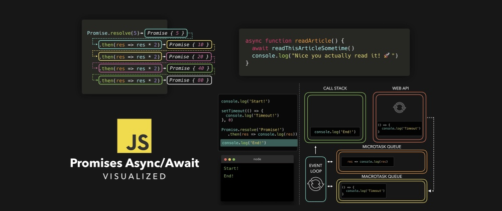
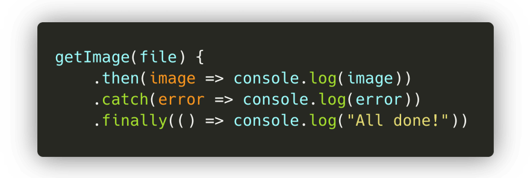
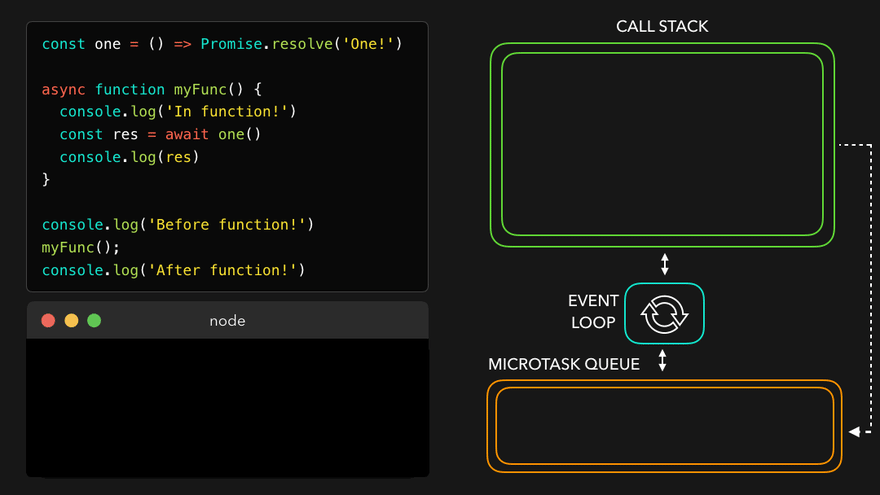

# 图解JavaScript Promises 和 Async/Await

你是否曾经遇到JS代码并没有按照你预期的方式运行？似乎函数是在随机、不可预测的时间执行的，或者执行被延迟了。如果是这样，那么你有可能正在处理ES6引入的一项很酷的新功能：**promise**！

我多年以来的好奇心得到了回报，而我不眠之夜又一次给了我时间制作一些动画。是时候讨论Promise了：**为什么**要使用promise？Promise在幕后是**如何**工作的？我们如何以最**现代**的方式编写promise呢？

* * *

## 简介

在编写JavaScript的时候，我们经常不得不去处理依赖于一些其它任务的任务！比如，我们要获取一副图像，对它进行压缩，应用一个滤镜，然后保存它📸。

要做的第一件事情就是**获取**我们要编辑的图像。一个`getImage()`函数可以负责这件事情！只有该图像已经被成功加载了，我们才能将该值传给一个`resizeImage()`函数。当该图像已经被成功调整大小后，我们想在`applyFilter()`函数中对该图像应用一个滤镜。在该图像已经被压缩，并且已经添加了滤镜后，我们要保存图像，让用户知道一切正常！🥳

最后，我们得到类似于这样的代码：

嗯...注意到这里的问题了么？虽然它还行，但是并非完美。我们最后得到了很多嵌套的回调函数，这些回调函数依赖于前一个回调函数。这通常被称为[回调地狱](http://callbackhell.com/)，因为我们最终得到了大量嵌套的回调函数，这让代码变得很难读！

好在我们现在有一个叫做**promise**的东西来帮助我们逃脱回调地狱！下面我们看看promise到底是什么，以及它们如何在这种情况下为我们提供帮助！😃

* * *

## Promise语法

ES6引入了**promise**。在很多教程中，你会读到类似以下的内容：

> "promise是一个值的占位符，这个值可以在将来的某个时间要么解决（resolve）要么拒绝（reject）"。

嗯...对我来说，这种解释从来没有让事情变得更清楚。实际上，这只让我觉得Promise是一种奇怪的、模糊的、不可预测的魔法。所以，下面我们来看看promise到底是什么。

我们可以用接收一个回调作为参数的`Promise`构造器，来创建一个promise。好酷，下面我们来试试吧！

等等，刚刚返回了什么？

`Promise`是一个包含一个**状态**（`[[PromiseStatus]]`）和一个**值**（`[[PromiseValue]]`）的对象。在上例中，我们可以看到`[[PromiseStatus]]`的值是`"pending"`，`[[PromiseValue]]`的值是`undefined`。

不用担心，我们永远都不会与该对象进行交互，甚至都无法访问`[[PromiseStatus]]`和`[[PromiseValue]]`属性！不过，在处理promise的时候，这两个属性的值很重要。

* * *

`PromiseStatus`的值，也就是promise的**状态**，可以是如下三个值之一：

* ✅ `fulfilled`：promise已经被解决（`resolved`）。一切顺利，在promise内没有发生错误 🥳。
* ❌ `rejected`：promise已经被拒绝了（`rejected`）。啊，出错了...
* ⏳ `pending`：promise既没有被解决，也没有被拒绝，依然在待处理中（`pending`）。

好吧，这听起来都很不错，但是**什么时候**一个promise的状态是`"pending"`、`"fulfilled"`或者`"rejected"`呢？为什么这个状态很重要呢？

在上例中，我们只是给`Promise`构造器传了一个简单的回调函数`() => {}`。不过，这个回调函数实际上接收两个参数。第一个参数的值，通常称为`resolve`或者`res`，这个值是在Promise应该**解决（resolve）**的时候被调用的方法。第二个参数的值，通常称为`reject`或者`rej`，是在有地方出错了，Promise应该被拒绝（reject）的时候被调用的方法。

下面我们试一下，看看在调用`resolve()`或`reject()`方法时的输出！在我的例子中，我称`resolve`方法为`res`，`reject`方法为`rej`。

太棒了！我们终于知道如何摆脱`"pending"`状态以及`undefined`值了！如果我们调用了`resolve()`方法，那么promise的状态就是`"fulfilled"`；如果我们调用了`reject()`方法，那么promise的状态就是`"rejected"`。

promise的**值**，也就是`[[PromiseValue]]`的值，就是我们传给`resolve()`或者`reject()`方法作为其参数的值。

> 有趣的是，我让Jake Archibald校对这篇文章，他实际上指出Chrome中存在一个bug，这个bug将promise的状态显示为`"resolved"`而不是`"fulfilled"`。多亏了[Mathias Bynens](https://twitter.com/mathias)，这个bug现在在Chrome Canary版中已经解决了！🥳🕺🏼
> 
> > 

* * *

好了，现在我们知道如何控制模糊的`Promise`对象了。但是它被用来什么呢？

在简介小节，我展示了一个例子，这里例子中我们获取一个图像、压缩图像、应用滤镜并保存图像！最终，代码变成了混乱的嵌套回调。

好在promise可以帮助我们解决此问题！首先，我们来重写整个代码块，让每个函数返回一个`Promise`。

如果图像被加载了，并且一切正常，那么我们就用已加载的图像**解决（resolve）**promise！否则，如果在加载文件的时候某处出错了，那么我们就用发生的错误**拒绝（reject）**promise。

下面我们看看在终端上执行这段代码时会发生什么！

很酷！就像我们所期待的那样，返回了一个带着被解析的数据的promise。

不过...现在要干什么呢？我们并不关心整个promise对象，只关心数据的值啊！好在有一些内置的方法来获取promise的值。对于一个promise，我们可以绑定三个方法：

* `.then()`：在promise**被解决**后得到调用。
* `.catch()`：在promise**被拒绝**后得到调用。
* `.finally()`：不管promise被解决了还是被拒绝了，**总是**会被调用。

`.then()`方法接收传给`resolve()`方法的值。

`.catch()`方法接收传给`reject()`方法的值。

最终我们得到了promise被解决后的值，而不需要整个promise对象！现在我们可以用这个值做任何我们向做的事情。

* * *

顺便提一句：当你知道一个promise总会解决或者总会拒绝时，你可以写成`Promise.resolve()`或者`Promise.reject()`，方法的参数就是想要解决或者拒绝promise所带的值！

在后面的示例中，你会经常看到这种语法😄。

* * *

在`getImage`示例中，我们最终不得不嵌套多个回调才能运行它们。好在`.then()`处理程序可以帮助我们解决这问题！🥳

`.then()`本身的结果就是一个promise值。也就是说，我们可以根据需要将多个`.then()`链起来：上一个`then`回调的结果会被作为参数传递给下一个`then`回调！

在`getImage`示例中，我们可以将多个`then`回调链起来，从而把处理过的图像传给下一个函数！最后得到的不是很多嵌套的回调，而是一个干净的`then`链。

完美！这种语法看起来已经比嵌套回调好多了。

* * *

## 微任务和宏任务

好了，现在我们更好地了解了如何创建promise，以及如何从promise中提取值。下面我们向脚本中添加更多代码，然后再次运行它：

等等，我们看到了什么？！ 🤯

首先，输出`Start!`。是的，我们已经看到了`console.log('Start!')`出现在第一行！不过，输出的第二个值是`End!`，而不是被解决的promise的值！只有在`End!`输出后，promise的值才被输出。这里发生了什么？

我们最终看到了promise的真正威力！🚀尽管JavaScript是单线程的，但是我们可以用`Promise`给它添加上异步行为！

* * *

但是，等等，我们之前就没有看到过异步吗？🤔 在《图解JavaScript事件循环》中，我们不也是用像`setTimeout`这类浏览器原生方法来创建某种异步行为吗？

是的！不过，在事件循环中，实际上有两种类型的队列：**宏任务队列**（或者只叫**任务队列**）、**微任务队列**。宏任务队列是针对**宏任务**，微任务队列只针对**微任务**。

那么什么是**宏任务**？什么是**微任务**呢？尽管它们比我在这里要介绍的内容要多一些，但是最常见的显示在下表中！

|---|---|---|
| 宏任务 | `setTimeout` | `setInterval` | `setImmediate` |
| 微任务 | `process.nextTick` | `Promise回调` | `queueMicrotask` |

啊，我们看到`Promise`是在微任务列表中！😃 当`Promise`解决了，并调用它的`then()`、`catch()`或者`finally()`方法时，方法内的回调就会被添加到**微任务队列**中！也就是说，`then()`、`catch()`或者`finally()`方法内的回调不是马上执行，这实际上是给我们的JavaScript代码增加了一些异步行为！

那么`then()`、`catch()`或者`finally()`回调什么时候执行呢？事件循环给任务赋予了不同的优先级：

1. 当前位于**调用栈**的所有函数得到执行。当它们返回值时，就会被从栈中弹出。
2. 当调用栈空了时，所有排队的微任务一个一个弹出到调用栈，并执行！（微任务本身也可以返回新的微任务，从而有效地创建无穷微任务循环😬）
3. 如果调用栈和微任务队列都空了，事件循环就检查宏任务队列是否有任务。任务弹到调用栈，执行，并弹出！

* * *

下面我们看一个简单的例子：

* `Task1`：立即被添加到调用栈的函数，比如通过在我们的代码中立即调用它。
* `Task2`、`Task3`、`Task4`：微任务，比如一个promise `then` 回调，或者一个用`queueMicrotask`添加的任务。
* `Task5`、`Task6`：宏任务，比如`setTimeout`或者`setImmediate`回调。

首先， `Task1`返回一个值，并从调用栈中弹出。然后，引擎检查微任务队列中排队的任务。一旦所有任务都被放在调用栈上，并且最终弹出了，引擎就检查宏任务队列中的任务，这些任务被弹到调用栈，并在它们返回值时弹出。

好了，好了，粉红盒子够多了。下面用一些真实代码来看看！

在这段代码中，我们有宏任务`setTimeout`，以及微任务 promise `then()` 回调。下面我们一步一步执行这段代码，看看输出什么！

* * *

> 提示 - 在如下的示例中，我在展示像`console.log`、`setTimeout`和`Promise.resolve`这些方法被添加到调用栈。这些方法是内部方法，实际上并不会出现在栈跟踪中。如果你在用调试器，而且在任何地方都看不到它们，请不要担心！这只是在不需要添加一堆样板代码的情况下，让解释这个概念更容易一些🙂

在第一行，引擎遇到了`console.log()`方法。该方法就被添加到调用栈，之后它就输出值`Start!`到控制台。该方法从调用栈中弹出，而引擎继续。

引擎遇到`setTimeout`方法，这个方法被压到调用栈。`setTimeout`方法是浏览器的原生方法：其回调函数（`() => console.log('In timeout')`）会被添加到Web API，直到定时器完成计时。虽然我们为定时器提供的值是`0`，但是回调依然会被先压到Web API，之后才被添加到**宏任务队列**：`setTimeout`是个宏任务！

引擎遇到`Promise.resolve()`方法。`Promise.resolve()`方法被压到调用栈，之后用值`Promise!`解决了。它的`then`回调函数被添加到**微任务队列**中。

引擎遇到`console.log()`方法。它马上被添加到调用栈，之后输出值`End!`到控制台，从调用栈弹出，引擎继续。

现在引擎看到调用栈是空的。既然调用栈是空的，它就要检查**微任务队列**中是否有排队的任务！是的，有任务，promise `then` 回调正在等待轮到它呢！然后回调就被压到调用栈，之后就输出promise被解决后的值：在本例中是`Promise!`。

引擎看到调用栈是空的，所以它要再次检查微任务队列，看看是否还有任务在排队。此时没有任务，微任务队列全部为空。

现在该检查**宏任务队列**了：`setTimeout`回调还在那里等着呢！`setTimeout`回调被压到调用栈。该回调函数返回`console.log`方法，输出字符串`"In timeout!"`。然后`setTimeout`回调从调用栈中弹出。

最后，所有事情都完成了！🥳 看起来好像我们之前看到的输出完全不是那么出乎意料的嘛。

* * *

## Async/Await

ES7引入了一种在JavaScript中添加异步行为的新方法，并且让处理promise变得更容易！通过引入`async`和`await`关键字，我们可以创建隐式返回一个promise的异步函数。不过，我们该怎么做呢？😮

之前，我们看到不管是通过键入`new Promise(() => {})`、`Promise.resolve`还是`Promise.reject`，都可以用`Promise`对象显式创建promise。

现在，我们无需显式使用`Promise`对象，就可以创建**隐式**返回一个promise对象的异步函数！这意味着我们不再需要自己编写任何`Promise`对象了。

尽管**async**函数隐式返回promise超级棒，但是在使用`await`关键字时才能看到`async`函数的真正威力！用`await`关键字，我们可以**挂起**异步函数，同时等待被`await`的值返回一个被解决过的promise。如果我们想要得到这个被解决后的promise的值，就像我们之前用`then()`回调做过的一样，我们可以将变量赋值给被`await`的promise值！

那么，我们可以**挂起**一个异步函数？OK，很棒，但是...这到底是什么意思？

下面我们来看看在运行如下代码块时会发生什么：

嗯。。。这是怎么回事呢？

首先，引擎遇到了一个`console.log`。它被压到调用栈，之后输出`Before function!`。

然后，我们调用异步函数`myFunc()`，之后`myFunc()`的函数体执行。在函数体内的第一行，我们调用另一个`console.log`，这次参数是字符串`In function!`。这个`console.log`被添加到调用栈，输出值，然后弹出。

函数体继续执行，我们来到第二行。最后，我们看到一个`await`关键字！ 🎉

发生的第一件事是被`await`的值执行了：在本例中是函数`one()`。该函数被弹到调用栈，最后返回一个被解决过的promise。一旦promise已经解决过了，`one()`就返回一个值，引擎就遇到`await`关键字。

当遇到一个`await`关键字时，`async`函数就**被挂起**。✋🏼 函数体的执行**被暂停**，异步函数的其余部分是以一个**微任务**的形式来执行，而不是常规任务！

现在，因为遇到了`await`关键字，异步函数`myFunc`就被挂起了，引擎就跳出异步函数，继续执行异步函数被调用时所在的执行上下文中的代码：在本例中是**全局执行上下文**！🏃🏽‍♀️

最后，在全局执行上下文中没有其它要执行的任务了！事件循环检查是否有排队的微任务：有！在解决了`one`的值后，异步`myFunc`函数在排队。`myFunc`被弹回到调用栈，并在先前中断的地方继续运行。

变量`res`最终得到了它的值，即`one`返回的解决过了的promise的值！我们用`res`的值调用`console.log`：在本例中是`One!`。`One!`被输出到控制台，从调用栈中弹出！ 😊

最后，所有代码都执行完了！你是否注意到`async`函数与一个promise `then`相比有何不同？`await`关键字会**挂起**`async`函数，而Promise体如果我们用了`then`就会继续执行！

* * *

嗯，确实有太多信息！🤯如果在处理Promise时候仍然感到不知所措，请不要担心，我个人认为，在处理异步JavaScript时，只是需要经验才能注意到模式，并感到自信。

不过，我希望你在处理异步JavaScript时可能遇到的意想不到的或者不可预测的行为现在会搞得更清楚点！

> 原文 by Lydia Hallie：[https://dev.to/lydiahallie/javascript-visualized-promises-async-await-5gke](https://dev.to/lydiahallie/javascript-visualized-promises-async-await-5gke)

