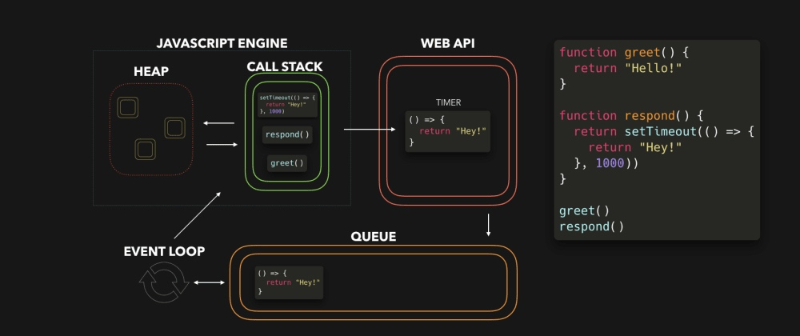
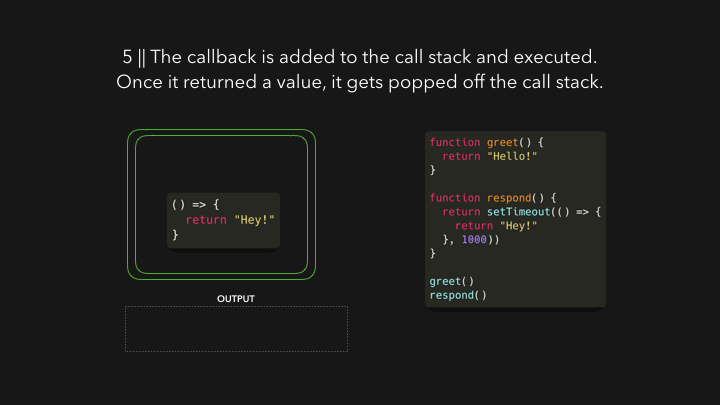

# 图解JavaScript事件循环



事件循环（Event Loop）是所有JavaScript开发者无论如何都要搞定的知识点之一，但是对于初学者来说，最初理解起来可能会有点困难。本文通过低分辨率的gif图像，以可视化的形式直观地讲解事件循环的机制。

首先我们来看看，事件循环是什么？为什么我们应该关注它呢？

我们知道，JavaScript是**单线程的**，也就是说，一次只能执行一个JavaScript任务。一般情况下，这不是什么大问题。不过，请想像一下，如果我们正在执行一个耗时30秒的任务，在此任务期间，我们得等待30秒才能进行其它任何操作（默认情况下，JavaScript在浏览器的主线程上执行，所以整个用户界面都停滞了）。现在是2020年了，没人想要一个速度慢、反应迟钝的网站。

好在浏览器提供了一些JavaScript引擎本身没有提供的功能：Web API。它包括DOM API、`setTimeout()`、HTTP请求等等。这些API可以帮助我们创建一些异步的、非阻塞的行为。

当我们调用一个函数时，该函数就被添加到调用栈（Call Stack）中。调用栈是JavaScript引擎的一部分，并非浏览器特有的。调用栈的“**栈**”，意味着它是先进后出（FILO）。当函数返回一个值时，该函数就会从栈中弹出。

[](media/15959047516091/gid1.6.gif)

在上图的JavaScript代码中，`respond()`函数返回一个`setTimeout()`函数。`setTimeout()`是由Web API提供给我们的：它让我们可以延迟执行一项任务，而不会阻塞主线程。我们传给`setTimeout()`函数的回调函数（即箭头函数`() => { return 'Hey' }`）被添加到Web API中。同时，`setTimeout()`函数和`respond()`函数从栈中弹出，因为它们都返回了它们的值！

[](media/15959047516091/gif2.1.gif)

在Web API中，定时器运行的时间与我们传给它的第二个参数一样长，即1000微秒。回调函数不会马上被添加到调用栈中，而是会传给队列。

[](media/15959047516091/gif3.1.gif)

这里就是最容易搞混的地方！请注意：回调函数并非是在1000毫秒后被添加到调用栈（从而返回一个值），而是在1000毫秒后被添加到**队列**中！既然是一个队列，函数就得排队，等着轮到它执行！

现在到了我们期待已久的部分：该事件循环出场了。事件循环只做一项任务：**将队列与调用栈连起来**！如果调用栈是**空的**，也就意味着之前所有被调用的函数都返回了它们的值，并且都已经从栈中弹出，那么队列中的**第一项**就会被添加到调用栈中。在本例中，没有其他函数被调用，这意味着当回调函数成为队列中的第一项时，调用栈是空的。

[](media/15959047516091/gif4.gif)

回调函数被添加到调用栈，被调用，并返回一个值，并从栈中弹出。

[](media/15959047516091/gif5.gif)

读一篇文章倒是很爽，不过只有反复实践，我们才会彻底掌握。OK，我们来看看如果执行下面这段代码，控制台上会输出什么：

```
const foo = () => console.log("First");
const bar = () => setTimeout(() => console.log("Second"), 500);
const baz = () => console.log("Third");

bar();
foo();
baz();
```

搞定了吗？下面我们快速看看在浏览器中执行这段代码时会发生什么：


1. 首先我们调用`bar()`。`bar()`返回一个`setTimeout()`函数。
2. 我们传给`setTimeout()`的回调被添加到Web API，`setTimeout()`函数和`bar()`从调用栈中弹出。
3. 定时器执行，同时`foo()`被调用，输出`First`。`foo()`返回（undefined），`baz()`被调用，回调函数被添加到队列。
4. `baz()`输出`Third`。在`baz()`被返回后，事件循环看到调用栈是空的，之后回调函数被添加到调用栈。
5. 回调函数输出`Second`。

希望本文能让你在理解JavaScript事件循环机制的时候稍微舒服点！如果还有点困惑，不要担心，最重要的是去理解某个错误或者行为可能来自何处，这样就能高效地用正确的术语在搜索引擎查找，最后在Stack Overflow页面上找到正确答案。

> 原文 by Lydia Hallie：[https://dev.to/lydiahallie/javascript-visualized-event-loop-3dif](https://dev.to/lydiahallie/javascript-visualized-event-loop-3dif)