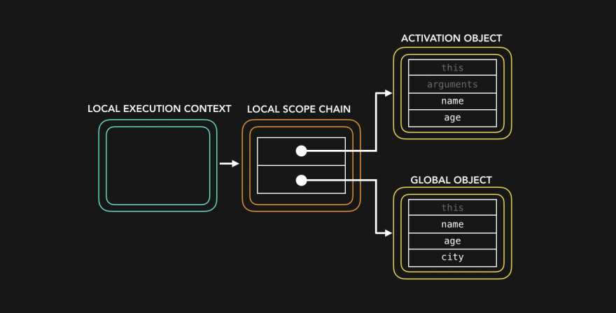
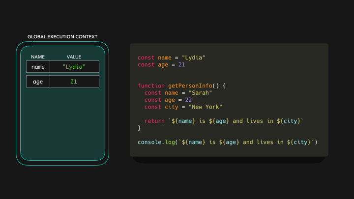

# 图解JavaScript作用域与作用域链


现在该讲作用域链了。在本文中，我假设你了解执行上下文的基础知识：尽管如此，我也会很快就此发表一篇文章。😃

* * *

我们来看看如下代码：

```
const name = "Lydia"
const age = 21
const city = "San Francisco"

function getPersonInfo() {
  const name = "Sarah"
  const age = 22

  return `${name} is ${age} and lives in ${city}`
}

console.log(getPersonInfo())
```

我们在调用`getPersonInfo()`函数，该函数返回一个字符串，其中包含`name`、`age`和`city`变量的值：`Sarah is 22 and lives in San Francisco`。不过，`getPersonInfo()`函数并没有包含名为`city`的变量，它是如何知道`city`的值的呢？

首先，内存空间是为不同的上下文设置的。我们有默认的**全局上下文（global context）**（在浏览器中是`window`，在Node中是`global`），以及针对已被调用的`getPersonInfo()`函数的**本地上下文（local context）**。每个上下文还有一个**作用域链（scope chain）**。

对于`getPersonInfo()`函数，作用域链看起来像这样（不要担心，现在还不需要完全搞清楚）：

[](media/15959138876318/89b9buizhevs0jf6djyn.png)

作用域链基本上是对对象的“引用链”，这些对象包含对在该执行上下文中可引用的值（和其他作用域）的引用。（⛓：“嘿，这些都是你可以在此执行上下文中引用的所有值”）。作用域链是在创建执行上下文时创建的，这意味着它是在运行时创建的！

但是，在本文中，我一般不会讨论活动对象（Activation Object）或执行上下文（execution context），我们只关注作用域！在如下的示例中，执行上下文中的键/值对表示作用域链中含有的对变量的引用。

[](media/15959138876318/iala2et7bg9bgdj4c2lg.png)

全局执行上下文的作用域链有对3个变量的引用：值为`Lydia`的`name`，值为`21`的`age`，以及值为`San Francisco`的`city`。在本地执行上下文中，有对2个变量的引用：值为`Sarah`的`name`，以及值为`22`的`age`。

当我们试图访问`getPersonInfo()`函数中的变量时，引擎会首先检查本地作用域链。

[](media/15959138876318/xn17f0t54acz8tiq7122.gif)

本地作用域链中有对`name`和`age`的引用！`name`的值为`Sarah`，`age`的值为`22`。但是现在，试图访问`city`时候会发生什么？

为了找到`city`的值，引擎会沿着作用域链向下找。这基本上只是意味着引擎不会轻易放弃：它会努力为你看看能否在本地作用域引用的外层作用域中找到变量`city`的值，在本例中，外层作用域是**global对象**。

[](media/15959138876318/z9iclg23rmbpts7meoq6.gif)

在全局执行上下文中，我们声明了变量`city`，其值为`San Francisco`，因此全局执行上下文中有一个对变量`city`的引用。现在我们有了该变量的值，函数`getPersonInfo()`就可以返回字符串`Sarah is 22 and lives in San Francisco` 🎉。

我们可以沿着作用域链向**下**找，但是不能沿着作用域链向**上**找。好吧，这可能会令人困惑，因为有人说的是向**上**而不是向**下**，所以我要重新表述一下：向**外层**作用域方向找，而不是向更内层作用域方向找。我喜欢将这用图形表示为一种瀑布：

[](media/15959138876318/doq46yc6nuiam51evy44.png)

甚至更深：

[](media/15959138876318/rece2zj4pb4w1fn56q5k.png)

下面我们以这段代码为示例。

[](media/15959138876318/0z6342b72f3n6v6ufafk.png)

代码几乎是一样的，不过有一个很大的不同点：现在我们只在`getPersonInfo()`函数中声明了`city`变量，但在全局作用域中没有声明。我们没有调用`getPersonInfo()`函数，因此也没有创建本地执行上下文。但是，我们试图在全局执行上下文中访问`name`、`age`和`city`的值。

[](media/15959138876318/f3wvlo4c3gqf3mve1g0n.gif)

然后它就抛出了一个`ReferenceError`错误！在全局作用域中找不到一个对变量`city`的引用，也没有可以查找的外层作用域，并且它**不能**沿着作用域向**上**查找。

这样，我们就可以把作用域作为保护变量并重用变量名的一种方法。

除了全局和本地作用域，还有一个**块作用域**。用`let`或者`const`关键字声明的变量的作用域为最接近的大括号（`{``}`）。

```
const age = 21

function checkAge() {
  if (age < 21) {
    const message = "You cannot drink!"
    return message
  } else {
    const message = "You can drink!"
    return message
  }
} 
```

可以把作用域用图形表示为：

[](media/15959138876318/75n1vpm7z4d8924cnvje.png)

这里我们有一个全局作用域，一个函数作用域和两个块作用域。我们能两次声明变量`message`，因为该变量的作用域范围是大括号内。

下面快速回顾一下：

* 可以把作用域链看作是对我们可以在当前执行上下文中可以访问的值的一个引用链。
* 作用域还让重用在作用域链向下更深层次定义的变量名成为可能，因为变量名只能沿着作用域向下找，而不能向上找。

关于作用域和作用域链就写到这里了！

> 原文 by Lydia Hallie：[https://dev.to/lydiahallie/javascript-visualized-scope-chain-13pd](https://dev.to/lydiahallie/javascript-visualized-scope-chain-13pd)