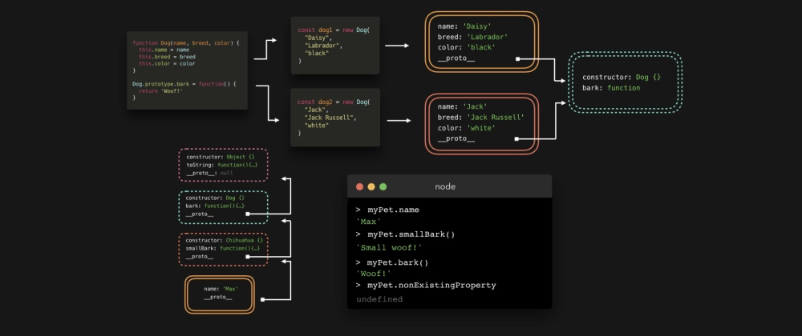
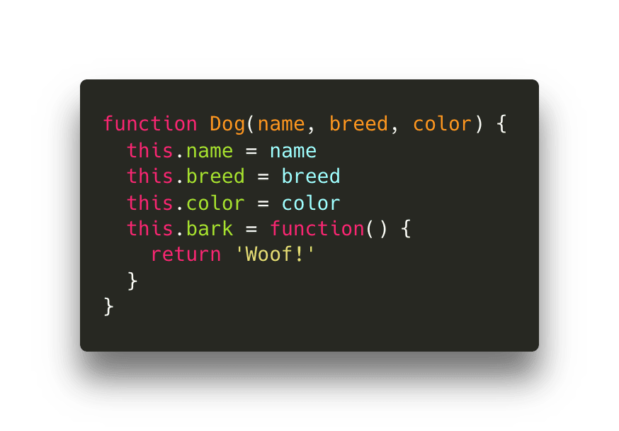
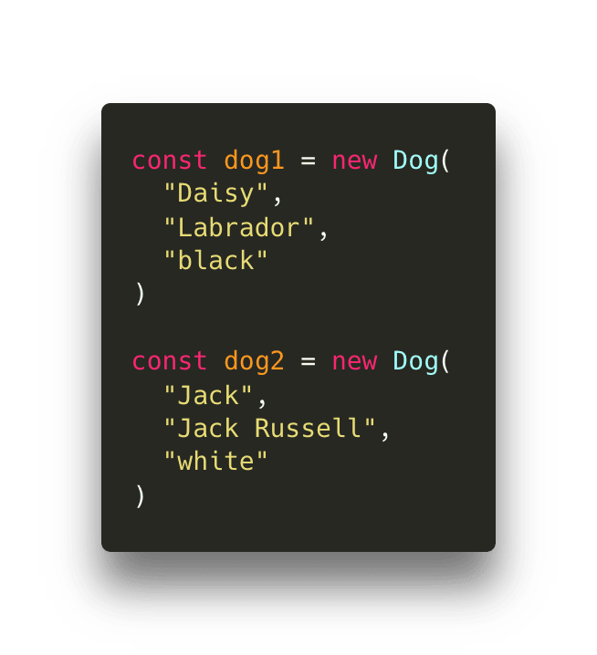
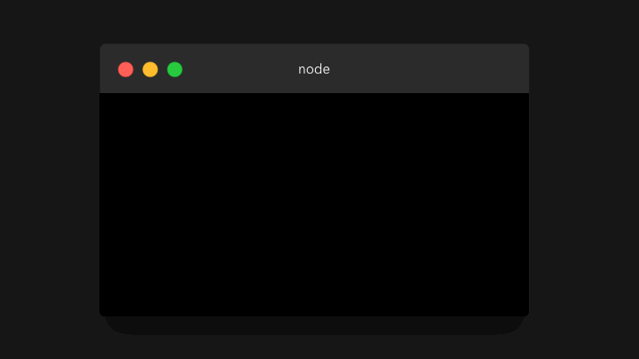
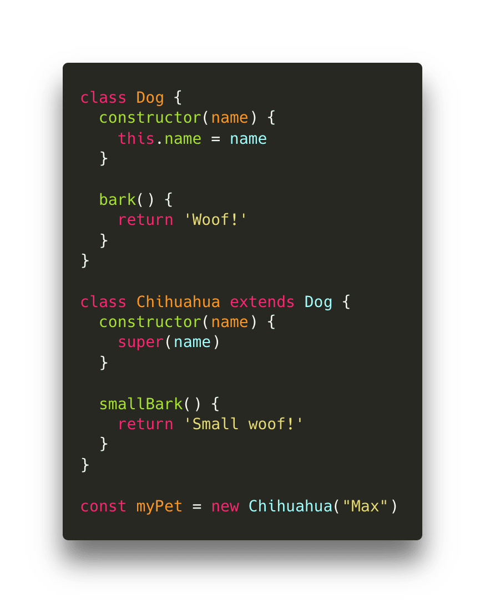
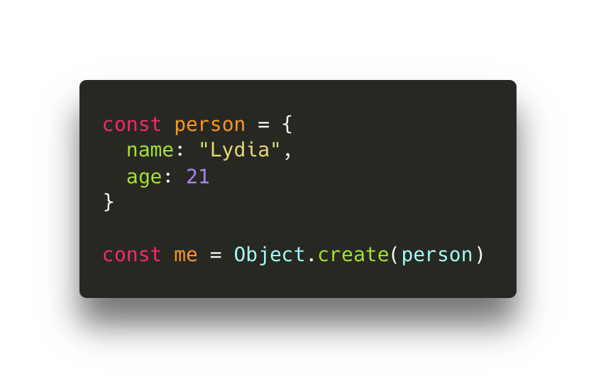

# 图解JavaScript原型继承

你有没有想过为什么我们可以在字符串、数组或对象上使用诸如`.length`、`.split()`、`.join（）`这些内置方法呢？我们从来没有明确指定过它们，它们到底是从哪里来的呢？现在别说“哈哈，没人知道，这就是神奇的JavaScript🧚🏻‍♂️”。这实际上是因为一种叫做原型继承（prototypal inheritance）的玩意儿。它很棒，而且我们用到它的次数比意识到它存在的次数要多得多！

我们经常要创建很多相同类型的对象。假设我们有一个网站，在这个网站上，人们可以浏览狗！

对每一只狗，我们都需要对象来表示它！🐕 我们用不着每次都写一个新对象，而是用一个构造器函数（我知道你在想什么，稍后我将介绍ES6类！），用`new`关键字创建Dog**实例**（不过，本文并非是要解释构造器函数，所以我不想谈太多）。

每只狗都有名字（name）、品种（breed）、颜色（color）以及一个bark()函数！

当我们创建`Dog`构造器函数时，它并不是我们创建的唯一对象。我们还自动创建了另一个对象，称为**prototype（原型）**！默认情况下，这个对象包含一个**constructor**属性，它只是对原始构造器函数的引用，在本例中是`Dog`。

Dog构造器函数上的`prototype`属性是不可枚举的，也就是说，当我们试图访问对象的属性时，它是不会出现。但它依然存在！

好吧，那么为什么我们会有这个属性对象呢？首先，我们来创建一些我们想展示的狗。为简单起见，我叫它们`dog1`和`dog2`。`dog1`是Daisy，一只可爱的黑色拉布拉多犬！`dog2`是Jack，一只无畏的白色杰克罗素犬！😎

下面我们把`dog1`输出到控制台，并展开其属性！

我们可以看到添加的属性，如`name`、`breed`、`color`和`bark`。但是`__proto__` 属性是什么玩意！它是不可枚举的，也就是说当我们试图获取对象的该属性时，它通常不会出现。下面我们把它展开！😃

哇哦，它看起来就像`Dog.prototype`对象！你猜怎么着，`__proto__`就是对`Dog.prototype`对象的一个引用。这就是**原型继承**的目的：构造器的每个实例都可以访问构造器的原型！🤯

为什么这很酷呢？有时我们有一些所有实例都共享的属性。比如本例中的`bark`函数：它对每个实例都是完全相同的，那么与其每次创建一个新的dog时都创建一个新函数，每次都消耗内存，还不如将其添加到`Dog.prototype`对象！🥳

每当我们试图访问实例上的属性时，引擎首先在本地搜索，看看该属性是否在对象本身上定义。不过，如果找不到我们要访问的属性，那么引擎就会通过`__proto__`属性**沿着原型链**遍历！

现在这只是一个步骤，但它可以包含几个步骤！如果继续往下看，我们就可能会注意到，当展开`__proto__`对象时，并没有包含一个显示`Dog.prototype`的属性。`Dog.prototype`本身是一个对象，也就是说它实际上是`Object`构造器的一个实例！这意味着`Dog.prototype`也包含一个`__proto__`属性，这个属性是对`Object.prototype`的一个引用！

最后，我们就有了所有内置方法来自何方的答案：它们在原型链上！😃

比如`.toString（）`方法。它是在`dog1`对象上本地定义的吗？嗯，不是的。。它是定义在`dog1.__proto__`的引用，即`Dog.prototype`对象上的吗？也不是！它是定义在`Dog.prototype.__proto__`的引用，即`Object.prototype`对象上的吗？是的！🙌🏼

现在，我们刚刚用过了构造器函数（`function Dog() { ... }`)，它仍然是有效的JavaScript。不过，ES6实际上为构造器函数以及处理原型引入了一种更简单的语法：类！

> 类只是构造器函数的**语法糖**。其工作机制还是一样的！

我们用`class`关键字编写类。类有一个`constructor`函数，它基本上就是我们用ES5语法编写的构造器函数！我们要添加到原型中的属性是在类主体本身上定义的。

类的另一个好处是，我们可以很容易地**继承**其他类。

假设我们要展示几只相同品种的狗，即吉娃娃狗（chihuahua）！不管咋样，吉娃娃依然是狗。为简单起见，我们现在只保留一个`name`属性给Dog类。不过这些吉娃娃也可以做些特别的事情，它们的叫声很小（smallBark），它们的叫声不是`Woof!`，而是`Small woof!`。🐕

在继承的类中，我们可以使用`super`关键字访问父类的构造器。父类的构造器期望的参数，我们必须传递给`super`：在本例中是`name`。

`myPet`既可以访问`Chihuahua.prototype`，又可以访问`Dog.prototype`（并且由于`Dog.prototype`是个对象，又可以自动访问`Object.prototype`）。

由于`Chihuahua.prototype`有`smallBark`函数，而`Dog.Prototype`有`bark`函数，因此在`myPet`上，我们既可以访问`smallBark`，也可以访问`bark`！

现在我们可以料想得到，原型链不会永远持续下去。最终有一个原型等于`null`的对象：在本例中就是`Object.prototype`对象！如果我们尝试访问在本地或原型链上找不到的属性，就会返回`undefined`。

尽管我在这里用构造器函数和类解释了将原型添加到对象的所有内容，但是将原型添加到对象还有一种方法，就是用`Object.create()`方法。用这个方法，我们可以创建一个新对象，并可以准确指定该对象的原型！💪🏼

为此，我们将**已有对象**作为参数传递给`Object.create`方法。该对象就是我们创建的对象的原型！

下面输出我们刚刚创建的`me`对象。

我们没有向对象`me`添加任何属性，它仅包含不可枚举的`__proto__`属性！`__proto__`属性引用了我们定义为原型的对象：`person`对象，它有一个`name`和一个`age`属性。由于`person`对象是一个对象，因此`person`对象上的`__proto__`属性值就是`Object.prototype`（不过为了使更容易阅读，我没有在gif上展开该属性！）。

* * *

希望你现在了解了为什么原型继承在JavaScript的美好世界中如此重要！如有疑问，请随时与我联系！😊

> 原文 by Lydia Hallie：[https://dev.to/lydiahallie/javascript-visualized-prototypal-inheritance-47co](https://dev.to/lydiahallie/javascript-visualized-prototypal-inheritance-47co)