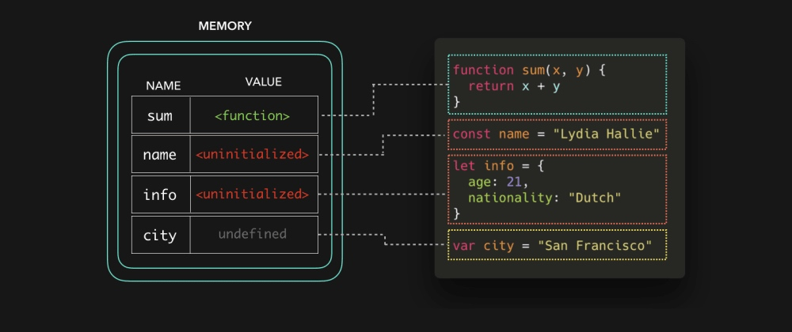

# 图解JavaScript变量提升（hoisting）

变量提升是每个JS开发人员都听说过的那些术语之一，因为你在搜索引擎上搜索烦人的错误，并且最终到StackOverflow上查找时，有人会告诉你这个错误是因为**变量提升（hoisting）**导致的。那么，什么是变量提升呢？(BTW，**作用域**会在另一篇文章中介绍，我希望保持文章小而专注）

如果你是JavaScript新手，那么你可能已经遇到过一些怪异的行为，比如，有些变量的值会偶然是`undefined`、抛出了`ReferenceError`错误，等等。变量提升经常被解释为*将变量和函数放到文件的顶部*。不过，尽管变量提升可能看起来像这样，但是背后并非如此😃。

当JS引擎获取我们的脚本时，它要做的第一件事情就是为我们代码中的数据**设置内存**。这时候没有执行任何代码，仅仅是在为执行准备好一切。函数声明和变量的存储方式是不同的。函数存储的是**对整个函数的一个引用**。

对变量来说，就有所不同了。ES6引入了两个新关键字来声明变量：`let`和`const`。用`let`或者`const`关键字声明的变量被存储的时候是*未被初始化的*。

用`var`关键字声明的变量以默认值`undefined`存储。

现在创建阶段已经完成，我们可以实际执行代码。下面我们来看看，如果在文件头部声明函数或者任何变量之前，有三条`console.log`语句的时候，会发生什么。

既然函数存储的是对整个函数代码的一个引用，那么我们甚至可以在创建他们的代码行之前调用他们！ 🔥

当我们在一个用`var`关键字声明的变量的变量声明之前引用该变量时，它只会返回存储的默认值`undefined`！不过，这样做有时候会导致不可预期的行为。大多数情况下，这意味着你无意中引用了它（你可能并不想它的值为`undefined`）😬。

为了防止我们像在用`var`关键字声明变量时那样一不小心就引用了一个`undefined`变量，只要我们试图访问**未被初始化**的变量时，就都会抛出一个`ReferenceError`错误。变量实际声明之前的“区域”称为**暂时性死区**：就不让我们在变量初始化之前引用该变量（这也包括ES6类！）。

当引擎通过我们实际声明变量的行时，内存中的值就被我们实际声明它们的值覆盖。

搞定！ 🎉下面我们快速回顾一下：

* 在执行代码之前，将函数和变量存储在内存中以用于执行上下文。这称为**变量提升（hoisting）**。
* 函数被存储为一个对整个函数的引用，用`var`关键字声明的变量的值为`undefined`，而用`let`和`const`关键字声明的变量未被初始化。

希望本文能让你搞清楚**变量提升（hoisting）**这个术语。

> 原文 by lydia hallie：[https://dev.to/lydiahallie/javascript-visualized-hoisting-478h](https://dev.to/lydiahallie/javascript-visualized-hoisting-478h)