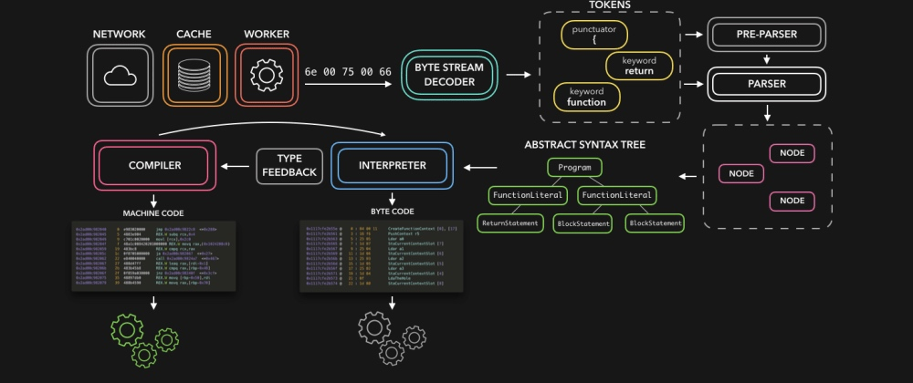
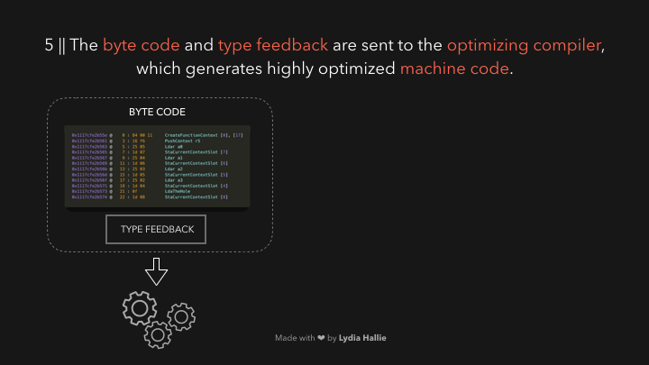
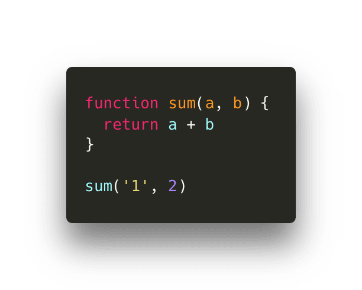

# 图解JavaScript引擎

JavaScript很酷，但是机器是如何才能真正理解我们所编写的代码呢？作为JavaScript开发人员，我们通常不必自己处理编译器。不过，一定要了解JavaScript引擎的基础知识，看看它如何处理我们对人类友好的JS代码，并将其转换成机器可以理解的东西！🥳

> 请注意：这篇文章主要基于Node.js和基于Chromium的浏览器使用的V8引擎。

HTML解析器遇到`script`标记，代码从**网络**、**缓存**或已装好的**service worker**加载。响应是把请求的脚本作为**字节流**，由字节流解码器负责！**字节流解码器**在下载字节流时对其进行解码。

字节流解码器从被解码的字节流中创建**标记（token）**。比如，`0066`解码为`f`，`0075`解码为`u`，`006e`解码为`n`，`0063`解码为`c`，`0074`解码为`t`，`0069`解码为`i`，`006f`解码为`o`，`006e`解码为`n`，后面跟一个空格。这不就是我们代码中写的`function`么！这是JavaScript中的一个保留关键字，会创建一个标记，并发送给解析器（和*预解析器*，这在gif中没有介绍，但稍后会解释）。字节流的其余部分也是这样的。

引擎使用两个解析器：**预解析器（Pre-Parser）**和**解析器（Parser）**。为了减少加载网站所需的时间，引擎尝试避免解析不需要立即执行的代码。预处理器处理稍后可能使用的代码，而解析器处理立即需要的代码！如果某个函数只在用户单击按钮后才被调用，那么就没有必要立即编译这段代码来加载到网站。如果用户最终单击按钮并需要这段代码，它才被发送到解析器。

解析器根据从字节流解码器接收的标记创建节点，并用这些节点创建一个抽象语法树或AST（Abstract Syntax Tree）。🌳

接下来，该**解释器（Interpreter）**出场了！ 解释器遍历AST，并根据AST所包含的信息生成**字节码**。字节码生成完毕后，会删除AST，以清除内存空间。最后，我们就有了一些机器可以处理的东西了！🎉

[

尽管字节码很快，但是它还可以更快点。随着此字节码运行，会生成一些信息。它可以检测某些行为是否经常发生，以及所使用的数据类型。可能我们已经调用了某个函数几十次数：该对它进行优化，让它运行得更快了！🏃🏽‍♀️ 

字节码与生成的类型反馈一起，被发送到**优化编译器**。优化编译器获取字节码和类型反馈，并从中生成高度优化过的机器码。  🚀

[

JavaScript是一种动态类型的语言，这意味着数据的类型可以不断变化。如果JavaScript引擎每次都得检查某个值是哪种数据类型，那就会非常慢。

为了减少解释代码所需的时间，优化过的机器码仅处理在执行字节码时引擎已经见过的情况。如果我们反复使用某段反复返回**相同**数据类型代码，那么就可以简单地重新使用经过优化的机器码以加快处理速度。不过，由于JavaScript是动态类型的，所以可能会发生同样的代码突然返回不同类型的数据的情况。如果发生这种情况，引擎就会对机器码进行非最佳化，并且会退回到解释生成的字节码。

假如某个函数被调用了100次，并且到目前为止一直返回相同的值，引擎就会假设在第101次调用它时还将返回该值。

假设我们有如下函数`sum`，（到目前为止）每次都使用数值作为参数来调用它：

这段代码会返回数字`3`！ 下次调用它时，引擎就会假定我们再次使用两个数值对其进行调用。

如果是这样，就无需进行动态查找，而只需重用优化过的机器码就可以了。否则，如果假设不正确，它将恢复为原始字节码，而不是优化过的机器码。

比如，下一次调用它时，我们传递的是字符串而不是数字。由于JavaScript是动态类型的，所以我们可以做到这一点而没有任何错误！

这意味着数字`2`会被强制转换为字符串，并且函数将返回字符串`12`。引擎会回过来执行解释过的字节码，并更新类型反馈。

-------

希望这篇文章对您有用！ 😊当然，我在这篇文章中没有涉及引擎的很多部分（JS堆、调用栈等），我稍后可能会涉及！ 如果您对JavaScript的内部机制感兴趣，我绝对鼓励您自己开始做一些研究，V8是开源的，并且有一些不错的文档说明其工作原理！🤖

[V8 Docs](https://v8.dev/) || [V8 Github](https://github.com/v8/v8) || [Chrome University 2018: Life Of A Script](https://www.youtube.com/watch?v=voDhHPNMEzg&t=729s%3Cbr%3E%0A)

> 原文 by Lydia Hallie：[https://dev.to/lydiahallie/javascript-visualized-the-javascript-engine-4cdf](https://dev.to/lydiahallie/javascript-visualized-the-javascript-engine-4cdf)